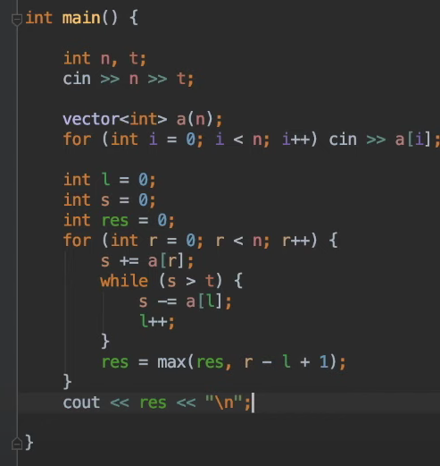

Если отрезок удовлетворяет 
То любой его подотрезок тоже удовлетворяет 

Заведем два укащателя l,r
отрезок от l до r хороший 
а от от l-1 до r плохой

Расширим отрезок от l до r+1
 
- если он хороший то свойство соблюджается
- если он плохой двигаем границу l до тех пор пока он не станет хорошим
  
https://codeforces.com/group/pgkaqF4igo/contest/256854
```go
for r:=0...n-1
    while [l..r] - плох
        l++
```

1. https://codeforces.com/group/pgkaqF4igo/contest/256854/problem/A
